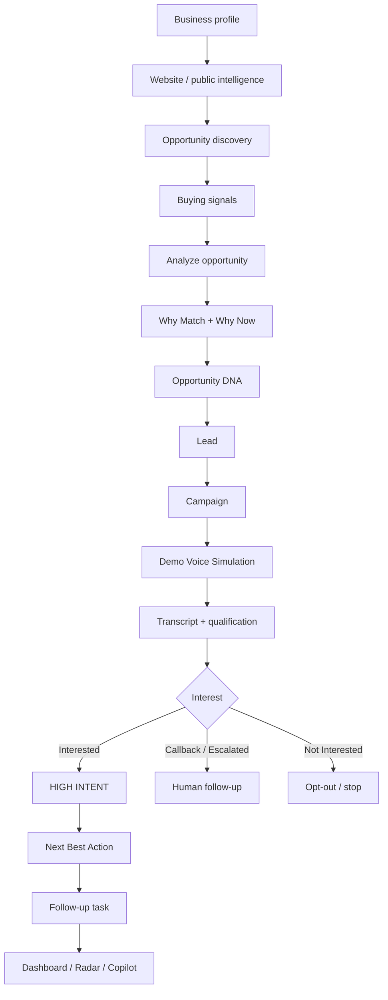
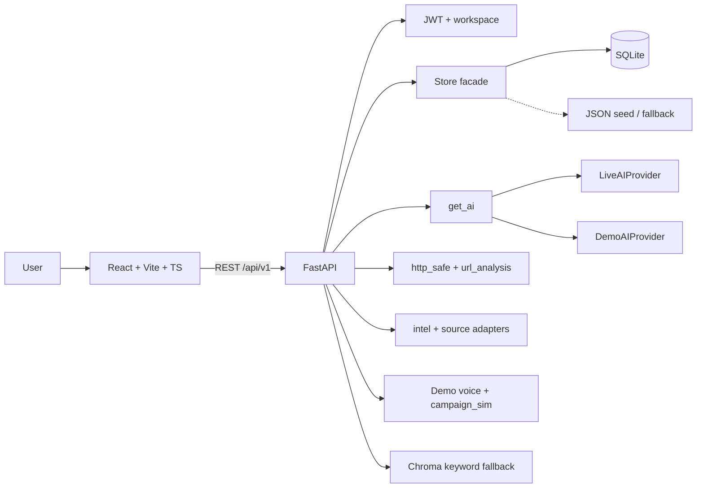

# Futurrizon AI Sales Agent

> An AI-powered sales intelligence platform that discovers opportunities, explains **why they match**, identifies **why now**, and recommends **what to do next**.

Hackathon MVP from **Futurrizon Technologies**. The product UI is branded **Lumina** (“Illuminating the Signal”).

[](https://www.python.org/)
[](https://fastapi.tiangolo.com/)
[](https://react.dev/)
[](https://www.typescriptlang.org/)
[](https://www.sqlite.org/)
[](#voice--conversation-system)

**Status:** hackathon MVP complete for simulated voice. Live telephony (Phase 2C) is **not implemented**.

---

## Table of contents

- [Overview](#overview)
- [Problem](#problem)
- [Solution](#solution)
- [Key features](#key-features)
- [WHO / WHY MATCH / WHY NOW / WHAT NEXT](#core-product-intelligence)
- [End-to-end workflow](#end-to-end-workflow)
- [Architecture](#architecture)
- [Technology stack](#technology-stack)
- [AI](#ai-architecture)
- [Website and market intelligence](#website-and-market-intelligence)
- [Real vs demo](#real-vs-demo)
- [Database](#database)
- [Security](#security)
- [Voice](#voice--conversation-system)
- [Campaigns](#campaigns)
- [Leads and segments](#leads-and-segments)
- [Radar](#radar)
- [Copilot](#copilot)
- [Dashboard](#dashboard)
- [Project structure](#project-structure)
- [Setup](#setup)
- [Environment variables](#environment-variables)
- [Demo walkthrough](#demo-walkthrough)
- [API](#api)
- [Testing](#testing)
- [Development phases](#development-phases)
- [Limitations](#limitations)
- [Roadmap](#roadmap)
- [Presenting to judges](#presenting-to-judges)
- [Team](#team)
- [License](#license)

---

## Overview

**Futurrizon AI Sales Agent** (Lumina) is a single-workspace sales workflow for teams that sell a defined service (the seeded seller is a Microsoft 365 / SharePoint consultancy).

It connects:

1. Understanding what the seller offers  
2. Finding public buying signals  
3. Explaining fit and timing with evidence  
4. Qualifying a prospect through a **demo voice simulation**  
5. Turning interest into a next-best-action and a follow-up task  

Designed for **sales operators, founders, and hackathon reviewers** who need a runnable closed loop — not a telephony production stack.

### Intelligence frame

| Lens | Question | Where it shows up |
|------|----------|-------------------|
| **WHO** | Who is the prospect / company? | Company, lead, enrichment, Opportunity DNA |
| **WHY MATCH** | Why does this requirement fit what we sell? | Opportunity analyze, DNA, Copilot |
| **WHY NOW** | What evidence suggests timing? | Hiring / requirement freshness, market signals |
| **WHAT NEXT** | What should a human do? | Next Best Action, tasks, dashboard |

---

## Problem

Sales work is usually split across research tabs, CRMs, call notes, and intuition:

Business understanding → prospect hunt → buying-signal research → outreach → conversation notes → “what do we do next?”

That fragmentation makes it hard to **prioritize**, **cite evidence**, and **hand off** a qualified conversation. This MVP does not replace a CRM; it demonstrates one evidence-bound loop from signal to follow-up.

---

## Solution

The app implements that loop in one FastAPI + React product:

Business profile (form or **website analysis**) → opportunity discovery (demo catalog + optional public fetch) → Why Match / Why Now / Opportunity DNA → lead → campaign → **Demo Voice Simulation** → transcript + qualification → Interested / HIGH INTENT → Next Best Action → task → dashboard, Radar, Copilot.

Voice is **DEMO / SIMULATION**. No Twilio, STT, TTS, or real outbound calls.

---

## Key features

### Business understanding

- Seller business profile (services, technologies, industries, locations)
- `POST /api/v1/business-profile/analyze-url` — SSRF-safe public HTML fetch, then structured fields
- Onboarding form + knowledge-document text
- Approve profile before treating it as the matching baseline

### Opportunity discovery

- Search adapters: **Demo Source**, **Public Web** (`backend/mock_data/public_feed.json`), **Company website** (bounded fetches)
- Buying signals, evidence quotes, opportunity heuristic **score** (deterministic; not overwritten by live AI)
- Why Match, Why Now, Opportunity DNA (requirement, tech, location, risks, missing fields)
- Market intelligence on the opportunity (hiring, funding, technology, growth/expansion **when evidence exists**)

### Lead management

- List / search / filter / sort / pipeline
- Static and dynamic **segments** (industry, location, company size, technology, score, intent, source, campaign, qualification status)
- CSV / XLSX import (preview + commit) and export
- Enrichment metadata on lead detail (source, confidence, last updated)

### AI sales intelligence

- `DemoAIProvider` — deterministic, offline
- `LiveAIProvider` — optional OpenAI-compatible `/v1/chat/completions`
- `get_ai()` fallback wrapper; `ai_source` / `ai_fallback_reason` on supported responses
- Copilot answers from **this workspace’s records** with citations
- Live AI may overlay **narratives** only; scores and NBA rules stay heuristic

### Market intelligence

- Signals with summary, source URL, evidence, confidence (evidence quality, not a probability), timestamps
- `is_demo` / REAL vs DEMO labels
- Cache of website fetches in SQLite `_meta` (TTL configurable)

### Campaigns

- Create, launch, pause, resume
- Quiet hours and retry **next-step simulation**
- Simulated outcomes: No Answer, Voicemail, Callback Requested, Interested, Not Interested, Escalated
- Opt-out / DNC check before simulate
- Workspace **live** mode **blocks** launch (`Live calling is not configured`)

### Voice — currently implemented (DEMO)

- Demo Voice Simulation (EN / HI / GU scripts)
- Agent playground
- Transcripts, qualification, interest detection, HIGH INTENT banner, human handoff, voicemail, opt-out
- Disclosure that the call is a demo simulation

### Voice — not implemented (FUTURE)

- Twilio or any carrier
- Real phone numbers, STT, TTS, live two-way audio

### Follow-up

- Next Best Action from qualification + opportunity
- Follow-up tasks for high-intent / callback / handoff

### Radar

- Saved searches, filters, frequency (`daily` / `weekly` stored), active/paused
- Run search → new match IDs → notification (one notification per run in current code)

### Dashboard and analytics

- Counts from stored leads, opportunities, campaigns, calls, tasks
- Call analytics KPIs (including workspace analytics JSON)

### Admin (role `admin`)

- Users, workspaces, campaigns, calls, usage, audit logs
- Suspend/activate user, pause/resume campaign

### Security (implemented)

JWT, bcrypt passwords, workspace isolation, IDOR 404s, SSRF-safe fetch, upload path sanitization, payload field stripping, rate limit on `/api/*`, no stack traces in 500s

---

## Core product intelligence

**WHO** — Company and lead records (name, industry, location, technologies). Contacts are shown only when present in data; the product is not allowed to invent phone/email.

**WHY MATCH** — Compares seller services/technologies to the requirement text and cites buying-signal evidence when available.

**WHY NOW** — Uses requirement freshness and hiring / expansion / funding evidence when those quotes exist. Demo seed (ABC Technologies) is labeled DEMO DATA.

**WHAT NEXT** — Rule-based Next Best Action (e.g. schedule a meeting after Interested; stop outreach after Not Interested).

**Opportunity DNA** — UI composition of stored opportunity fields (requirement, need, technology, location, timeline, budget note, signals, Why Match / Why Now, score breakdown). Not a separate ML model.

**Next Best Action** — Deterministic mapping from qualification `interest_level` to an action, why, priority, and evidence list.

---

## End-to-end workflow



---

## Architecture



Request path: **UI → FastAPI → `store.py` → SQLite** (JSON files if SQLite cannot start). Chroma is **RAG for knowledge docs only**, not generation.

---

## Technology stack

| Layer | Technology | Purpose |
|-------|------------|---------|
| Frontend | React 19, Vite 8, TypeScript 6, React Router 7 | SPA, light mode only |
| Styling | Tailwind CSS 4 | UI |
| HTTP client | Axios | `/api/v1` + Vite proxy |
| Backend | FastAPI 0.115, Uvicorn, Pydantic 2 | REST API |
| Auth | PyJWT, bcrypt | Tokens and password hashes |
| Database | SQLite | Primary runtime store |
| Seed | JSON under `backend/mock_data/` | First-run seed and demo catalog |
| AI | Stdlib HTTP to OpenAI-compatible Chat Completions | Optional live narratives |
| Documents | pypdf, python-docx, openpyxl | Knowledge + import/export |
| RAG | ChromaDB | Document chunks; keyword fallback if Chroma fails |
| Tests | pytest | Backend suite |

Not used: PostgreSQL, MongoDB, Redis, Celery, Kafka, Kubernetes, LangChain, Twilio.

---

## AI architecture

```text
get_ai()  →  FallbackAIProvider
                 ├── LiveAIProvider   (if AI_PROVIDER is not demo AND OPENAI_API_KEY is set)
                 └── DemoAIProvider   (always available)
```

| Behavior | Implementation |
|----------|----------------|
| No key / `AI_PROVIDER=demo` | Demo only; `ai_source: demo` |
| Live success | `ai_source: live` |
| Live timeout, 401, 429, 5xx, bad JSON, safety refusal | Demo result + `ai_source: demo_fallback` + `ai_fallback_reason` |
| Opportunity **score** | Heuristic in `DemoAIProvider.analyze_opportunity` — live cannot change totals |
| `plan_search`, `next_best_action` | Always demo rules |
| Keys | Process env / `.env` only — never frontend `VITE_*`, never SQLite secrets |

Prompted live calls treat website and user text as **UNTRUSTED_INPUT**.

---

## Website and market intelligence

```text
URL → validate_public_url (scheme, localhost, private IPs, DNS re-check)
    → robots.txt (best-effort)
    → fetch (timeout, 80KB, 3 redirects each re-validated, HTML)
    → extract visible text
    → bounded excerpt → get_ai().understand_business
    → optional same-host careers/news links (max 2)
    → market signals only if a quote is found in the text
```

Failures on `example.com` / Northwind hosts return labeled **DEMO DATA**. Other fetch failures return **Not detected** (nothing invented as live). `example.com` catalog hosts are not treated as live sources.

---

## Real vs demo

| | REAL (when it happens) | DEMO / SIMULATION |
|--|------------------------|-------------------|
| AI | OpenAI-compatible API if configured and healthy | Deterministic `DemoAIProvider` |
| Website | Successful public HTML fetch, `label: REAL SOURCE`, `is_demo: false` | Seed JSON, `public_feed.json`, Northwind fallback, `is_demo: true` |
| ABC Technologies | — | Seeded `opp_abc` / `lead_abc` |
| Voice / campaigns | — | Always simulation; launch blocked in workspace live mode |
| Market signals | Created only from fetched quotes | Seeded hiring/tech/expansion rows |

The application **runs fully without an API key and without the public internet** (aside from optional live URL checks).

---

## Database

Primary file: `backend/data/sales_agent.db` (gitignored). Collections (payload JSON per row):

`users`, `workspaces`, `workspace_members`, `companies`, `contacts`, `business_profiles`, `voice_agents`, `knowledge_documents`, `buying_signals`, `opportunities`, `leads`, `campaigns`, `calls`, `transcripts`, `qualifications`, `tasks`, `lead_segments`, `saved_searches`, `notifications`, `market_signals`, `audit_logs`, `opt_outs`, plus `analytics` and `_meta`.

- `PRAGMA foreign_keys = ON` on every app connection  
- Circular lead ↔ opportunity IDs are **not** SQL foreign keys (avoids seed deadlocks)  
- Reseed: `python scripts/reset_demo.py`

---

## Security

| Area | What the code does |
|------|-------------------|
| Auth | JWT (`JWT_SECRET`, expiry minutes), bcrypt hashes, 401/403 |
| Tenancy | `X-Workspace-Id` cannot point at another user’s workspace (404) |
| IDOR | Resource `workspace_id` must match; missing/foreign IDs → 404 |
| Patches | Strip `workspace_id`, `id`, `role`, `password_hash`, … |
| Uploads | Extension allow-list, 8MB, `safe_dest` under workspace folder |
| SSRF | No `file://`/`ftp://`, no localhost/private/link-local, redirect checks |
| API | Validation 422, rate limit (~180/min/IP), generic 500 message |
| AI | Keys server-side; malformed live JSON → fallback |

Default `JWT_SECRET` is for **local hackathon only**. Replace it before any shared deploy.

---

## Voice and conversation system

```text
Lead → Campaign → Demo Voice Simulation → turns → transcript
     → qualification → Interested / Callback / Not Interested / Escalated / Voicemail / No Answer
     → NBA + optional task / opt-out
```

Supported simulation outcomes: No Answer, Voicemail, Connected, Callback Requested, Interested, Not Interested, Escalated / human handoff. Pricing answers refuse unpublished prices.

**Future / optional (Phase 2C, not in this repo):** Twilio, live outbound, STT, TTS, real-time audio.

---

## Campaigns

Draft → launch (demo only) → running / scheduled → pause / resume. Next-step uses `retry_policy.sequence` and quiet hours. Simulation never sends SMS, email, or PSTN.

---

## Leads and segments

Dynamic segments use field filters (`equals`, `contains`, `greater_than`, `in`, …). Static segments use an explicit `lead_ids` list. Preview / edit / delete are implemented.

---

## Radar

Saved searches store query, filters, source, frequency, status. `POST /api/v1/saved-searches/{id}/run` searches adapters and can create a Radar notification for a new match.

---

## Copilot

`POST /api/v1/copilot/ask` — workspace-scoped records only. Citations must refer to IDs in that workspace. Cross-workspace ABC citations are not allowed. Live Copilot still requires valid citation IDs or falls back to demo.

---

## Dashboard

`GET /api/v1/dashboard` and `GET /api/v1/analytics/calls` aggregate stored rows (opportunities, high-intent / high-score leads, campaigns, calls, follow-up tasks). Insights are derived from those counts, not hardcoded KPI dashboards.

---

## Project structure

```text
futurrizon/
├── .env.example
├── .gitignore
├── README.md
├── backend/
│   ├── app/
│   │   ├── main.py              # HTTP API
│   │   ├── store.py             # SQLite facade + JSON fallback
│   │   ├── db.py / sqlite_store.py / seed.py
│   │   ├── ai.py                # Demo + Live + get_ai()
│   │   ├── http_safe.py / url_analysis.py / intel.py / sources.py
│   │   ├── voice.py / campaign_sim.py / segmentation.py
│   │   ├── knowledge.py         # Chroma + keyword fallback
│   │   ├── sanitize.py / deps.py
│   │   └── core/config.py, security.py
│   ├── mock_data/               # JSON seed + public_feed.json
│   ├── data/                    # SQLite file (gitignored)
│   ├── tests/
│   ├── scripts/reset_demo.py
│   ├── requirements.txt
│   └── pytest.ini
└── frontend/
    ├── package.json             # dev / build / preview
    └── src/pages/               # Lumina UI (light mode)
```

---

## Setup

**Prerequisites:** Python **3.11** (verified in this environment), Node.js + npm (Vite 8 frontend).

```bash
git clone https://github.com/git112/ai-sales-agent.git
cd ai-sales-agent
```

### Backend

```bash
cd backend
python -m venv .venv
.venv\Scripts\activate
pip install -r requirements.txt
copy ..\.env.example ..\.env
python -m uvicorn app.main:app --reload --port 8000
```

On macOS/Linux use `source .venv/bin/activate` and `cp ../.env.example ../.env`.

Health: [http://127.0.0.1:8000/health](http://127.0.0.1:8000/health)  
OpenAPI: [http://127.0.0.1:8000/docs](http://127.0.0.1:8000/docs)

### Frontend

```bash
cd frontend
npm install
npm run dev
```

App: [http://localhost:5173](http://localhost:5173) — Vite proxies `/api` and `/health` to port 8000.

Reset demo database:

```bash
cd backend
python scripts/reset_demo.py
```

---

## Environment variables

From `.env.example` and `backend/app/core/config.py`. Copy to `.env` (gitignored). **Never** put keys in frontend env.

| Variable | Required for demo | Purpose |
|----------|-------------------|---------|
| `APP_ENV` | No | Default `hackathon` |
| `JWT_SECRET` | Recommended | Replace before sharing the app |
| `JWT_EXPIRE_MINUTES` | No | Default 720 |
| `CORS_ORIGINS` | No | Default `http://localhost:5173` |
| `DEFAULT_APP_MODE` | No | `demo` |
| `UPLOAD_DIR` | No | Knowledge uploads |
| `CHROMA_PATH` | No | Local Chroma path |
| `AI_PROVIDER` | No | `demo` (default) or `openai` |
| `OPENAI_API_KEY` | **Live AI only** | Server-side |
| `OPENAI_MODEL` | No | Default `gpt-4o-mini` |
| `AI_BASE_URL` | No | OpenAI-compatible base |
| `AI_TIMEOUT_SECONDS` | No | Default 10 |
| `AI_MAX_OUTPUT_TOKENS` | No | Default 800 |
| `URL_CACHE_TTL_SECONDS` | No | Website cache TTL |

SQLite path is configured in code as `sqlite_path` (default `data/sales_agent.db` under `backend/`). It is not listed in `.env.example`.

---

## Demo walkthrough

Seeded accounts (from mock data):

| Role | Email | Password |
|------|-------|----------|
| User | `demo@example.com` | `Demo123!` |
| Admin | `admin@example.com` | `Admin123!` |

1. Start backend (`:8000`) and frontend (`:5173`).  
2. Log in as demo user (`workspace_001`).  
3. Onboarding / business profile (optional: Analyze website). Approve profile.  
4. Opportunities → **ABC Technologies** (`opp_abc`) — DEMO DATA.  
5. Tabs: Why Match, Why Now, Opportunity DNA, Evidence, Market Intelligence, Enrichment.  
6. Analyze opportunity (score stays heuristic).  
7. Leads → `lead_abc` → segments / import if needed.  
8. Campaigns → launch **demo** campaign → simulate call, outcome **Interested**.  
9. Confirm transcript, qualification, HIGH INTENT, Next Best Action, follow-up task.  
10. Dashboard, Analytics, Radar, Notifications, Copilot (“Show high-intent leads.”).  
11. Admin routes require `admin@example.com`.

---

## API

Interactive docs: `/docs`. Liveness: `GET /health` → `{ "ok", "mode", "datastore": "sqlite" | "json" }`.

Prefix: `/api/v1`

| Area | Examples |
|------|----------|
| Auth | `/auth/login`, `/auth/signup`, `/auth/me` |
| Workspace | `/workspaces`, `/workspaces/{id}/mode` |
| Business | `/business-profile`, `/analyze`, `/analyze-url`, `/approve` |
| Knowledge | `/knowledge`, upload PDF/DOCX/TXT |
| Opportunities | `/opportunities`, `/search`, `/{id}/analyze`, `/market-intelligence` |
| Leads | `/leads`, import/export, `/segments` |
| Voice / campaigns | `/voice-agents`, `/campaigns/{id}/calls/simulate`, `/calls` |
| Copilot | `/copilot/ask` |
| Radar | `/saved-searches`, `/notifications` |
| Admin | `/admin/users`, `/admin/audit-logs`, … |

---

## Testing

```bash
cd backend
python -m pytest -q

cd ../frontend
npx tsc --noEmit
npm run build
```

Verified in this workspace (20 Sep 2026):

| Check | Result |
|-------|--------|
| Backend tests (`python -m pytest -q`) | **39 passed** |
| TypeScript (`tsc` via `npm run build`) | Passed |
| Production build (`tsc && vite build`) | Passed |
| Live telephony | Not implemented |

---

## Development phases

These describe how the MVP was built. The product is one application.

| Phase | What landed | Status |
|-------|-------------|--------|
| **1** | Core workflow + SQLite primary store, JSON seed/fallback | Done |
| **2A** | Live AI provider + demo fallback (`get_ai()`) | Done |
| **2B** | SSRF-safe website fetch + source-aware market signals | Done |
| **3** | Tenant isolation, uploads, QA, demo readiness | Done |
| **2C** | Live voice / Twilio / STT / TTS | **Optional / not implemented** |

---

## Current status

| Capability | Status |
|------------|--------|
| Core sales workflow | Implemented |
| SQLite persistence | Implemented |
| Live AI + demo fallback | Implemented |
| Website intelligence | Implemented (bounded, public HTML) |
| Market intelligence | Implemented (evidence required) |
| Lead / segment / import | Implemented |
| Campaigns | Implemented (**simulation**) |
| Voice | **Demo simulation only** |
| Live telephony | Not implemented |
| Security hardening | Implemented for local MVP |
| Automated tests | Implemented |

---

## Limitations

- Voice and campaign outreach are **simulations**; workspace live mode refuses real calling.  
- Website intelligence is **not** an open crawler (homepage + at most two same-host links).  
- `example.com` demo hosts are never treated as live.  
- Confidence is **evidence quality**, not a probability of truth.  
- Opportunity score is a **fixed heuristic**, not a learned model.  
- Copilot only knows workspace records it is given.  
- Default JWT secret is for local demo.  
- Chroma may fall back to keyword search if the vector store is unavailable.

---

## Roadmap

**Optional Phase 2C:** Twilio (or similar), real outbound calls, STT, TTS, live conversation, recording — none of this is in the current codebase.

Other production topics (not claimed as done): stronger secret management, hosted Postgres, rate limits per tenant, CI badges.

---

## Presenting to judges

1. Business understanding (Northwind / URL analysis).  
2. Find **ABC Technologies** — DEMO DATA.  
3. **WHY MATCH** then **WHY NOW** with evidence.  
4. Opportunity DNA + score disclaimer.  
5. Campaign → **Demo Voice Simulation** → Interested → HIGH INTENT.  
6. Next Best Action + task.  
7. Dashboard, market intelligence, Radar, Copilot.  
8. State clearly: **live phones are future work**; AI and website fetch are real when configured, with demo fallback so the pitch never depends on a vendor outage.

---

## Why this project

It ties **research → evidence → conversation (simulated) → action** in one loop so a human closer sees *who*, *why this fit*, *why this timing*, and *what to do in the next 24 hours* — without claiming autonomous selling or guaranteed conversions.

---

## Team

Hackathon project for **Futurrizon Technologies**. Add member names and roles here if you publish a team list.

---

## License

License is not specified in this repository.
